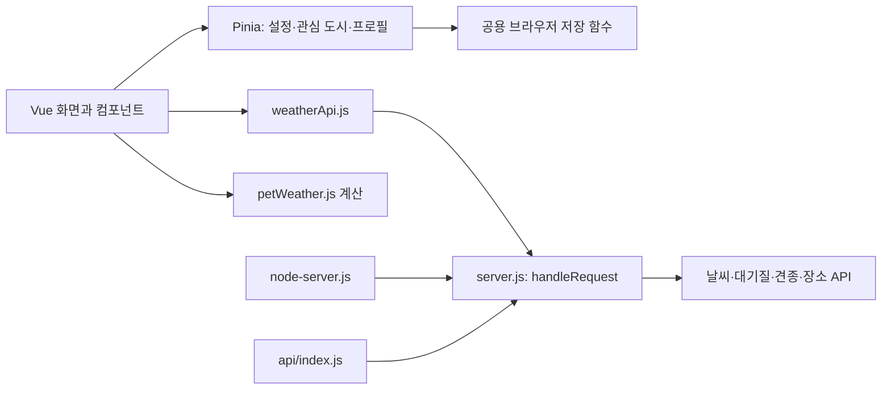

# Walkie 초기 개발 기반과 확장 순서

2026-10-06 기준 소스 검토와 이번 작업 범위다. 기능별 완료 여부는 실제 검사 결과로 판단하며, 아래 후속 기능은 아직 구현하지 않았다.

## 1. 현행 흐름과 첫 개선 이유

| 경로 | 현재 책임 | 확인한 개선 지점 |
| --- | --- | --- |
| `src/services/weatherApi.js` | 같은 출처의 날씨·지역 검색·견종·장소 API 호출 | 서버 키를 브라우저에 전달하지 않는 경계를 유지한다. |
| `src/services/petWeather.js` | 산책 점수·체감온도·시간대·플랜 계산 | Vue·Pinia·HTTP 의존성이 없는 계산 함수를 확장에도 재사용한다. |
| `src/stores/configStore.js`, `favoriteStore.js` | 온도 설정과 관심 도시 상태 | 검토 시작 시 메모리 상태여서 새로고침하면 초기화된다. |
| `src/components/practices/handson/weather-components/DogWalkGuide.vue` | 차트·프로필 편집·맞춤 산책 안내 | 검토 시작 시 프로필의 읽기·저장·삭제를 화면에서 직접 처리한다. 잘못된 JSON, 저장 차단·용량 부족과 데이터 타입을 함께 다룰 공용 경계가 필요하다. |
| `src/components/practices/handson/weather-components/WeatherParent.vue` | 목록 로딩·검색·선택·화면별 계산 | 지역 검색은 500ms 대기와 응답 순서 확인이 이미 있다. 이 동작을 유지한다. |
| `src/views/DogWalkView.vue`, `WeatherDetailView.vue` | 경로에 맞는 상세 조회와 로딩·오류 표시 | 상세 요청의 응답 순서 제어는 검색과 달리 없다. 빠른 지역 전환에서 오래된 응답이 최신 화면을 덮는지 후속 확인한다. |
| `server.js`, `server-utils.js` | 외부 API 호출, 요청 검증, 응답·오류 처리 | `handleRequest`를 로컬과 배포가 공유한다. 검증을 화면마다 복제하지 않는다. |
| `node-server.js`, `api/index.js` | 로컬 HTTP·Vercel 진입점 | API 처리를 같은 `handleRequest`로 연결한다. |
| `src/components/PetPlacesMap.vue` | 버튼 요청 후 위치 조회·주변 장소 표시 | 위치 저장을 추가하지 않는다. GET 쿼리에 좌표가 포함되는 운영 로그는 별도 확인한다. |
| `vercel.json`, `.gitignore`, `test/` | 배포 헤더·민감 파일 제외·Node 자동 검사 | 실제 운영 반영과 요청 제한은 저장소 검사만으로 확정할 수 없다. |

상태를 저장하는 화면이 늘기 전에 관심 도시·온도 설정·단일 반려견 프로필의 저장 방식을 통일한다. 산책 기록을 먼저 붙이면 동일한 저장 오류와 중복 책임을 한 번 더 만들게 된다.



## 2. 실제 활용 역할과 작업 경계

| 역할 | 이번 담당 | 후속 활용 시점 |
| --- | --- | --- |
| Software Architect | 현행 흐름 분석, 이 문서의 범위·저장 규칙·확장 의존성 설계 | 산책 기록·가족 공유에서 실제 데이터 경계가 바뀔 때 |
| Frontend Developer | 공용 브라우저 저장 함수, 관심 도시·온도 설정 영속화, 프로필 Pinia 분리와 회귀 검사 | 산책 기록 화면·주간 요약 구현 |
| DevOps Automator | CI, 민감값 검사, 운영 응답 점검 스크립트, 수정 없는 검사 명령 | 실제 배포 후 헤더·API·요청 제한 확인 |
| Application Security Engineer | 저장값 검증·민감값 검사·CI 신뢰 경계의 독립 보안 검토 | 로그인과 가족 공유 도입 시 소유권·접근 제어 검토 |

한 개인 프로젝트에서 담당 파일을 나누고 조정자가 결과를 통합한다. 별도의 조직 승인 절차나 상시 에이전트 운영은 만들지 않는다. 역할을 찾거나 문서를 읽은 것과 실제 역할 에이전트를 실행한 것은 구분한다.

## 3. 선택한 구조와 대안

현재 Vue·Pinia와 공유 Node API를 유지한다. 외부 호출은 `services`, 여러 화면이 공유하는 사용자 상태는 `stores`, 입력·로딩·오류·표현은 `views`와 `components`가 담당한다. 데이터는 서비스 또는 저장 함수에서 store를 거쳐 화면으로 흐르며, 코드 의존성은 화면 → store·service 방향이다. `petWeather.js`의 순수 계산은 화면에서 직접 재사용해도 된다.

| 선택지 | 얻는 것 | 한계와 선택 시점 |
| --- | --- | --- |
| 브라우저 저장 + 기존 Pinia 유지 — 이번 선택 | 계정·서버 저장소 없이 새로고침 후 개인 설정 유지, 기존 구조의 작은 변경 | 같은 브라우저·출처에 한정된다. 브라우저 데이터 삭제나 여러 탭의 동시 편집을 서버처럼 보장하지 않는다. |
| 로그인 + 서버 저장소 | 기기 간 복구·동기화, 가족별 권한과 공동 기록 | 인증·소유권·삭제·동시 수정 규칙이 추가된다. 가족 공유 또는 기기 간 동기화가 실제 요구가 될 때 설계한다. |

별도 도메인 계층, 인터페이스, 범용 repository, Redis, 마이크로서비스와 새 의존성은 현재 범위에 필요하지 않다. 공유하지 않는 날씨 목록·검색어·접힘 상태는 화면에 남기며, 폴더 이름을 정리하기 위한 일괄 이동도 하지 않는다.

최소 구조는 다음과 같다. 실제로 생성한 저장 모듈과 프로필 store를 기준으로 하며, 기능별 검증 결과는 통합 후 별도로 기록한다.

```text
src/
  services/
    weatherApi.js                   # 기존 HTTP 호출
    petWeather.js                   # 기존 순수 계산
    browserStorage.js               # 안전한 읽기·쓰기·삭제
  stores/
    configStore.js                  # 기존 온도 단위·표시 정밀도
    favoriteStore.js                # 기존 관심 도시
    petProfileStore.js              # 프로필 검증·저장·초기화
  views/                           # 기존 경로별 조회와 화면 구성
  components/                      # 기존 입력·차트·안내
server.js                          # 기존 공용 API 처리
server-utils.js                    # 기존 신뢰 경계 검증
api/                               # 기존 Vercel 진입점
test/                              # 기존 node:test 재사용
scripts/                           # 이번 운영·민감값 점검용
.github/workflows/                 # 이번 CI용
docs/development-foundation.md     # 이 문서
```

## 4. 이번 첫 개발 범위와 수용 기준

이번 구현은 다음 두 묶음이다. 실제 수행 결과는 9절에 기록한다.

| 묶음 | 수용 기준 |
| --- | --- |
| 저장·상태 정리 | 기본 6개 관심 도시·온도 설정·저장한 프로필이 store 재생성 후 복구된다. 검색 지역의 좌표가 포함된 ID는 현재 방문에서만 유지하고 안내한다. 저장값을 허용 필드·타입·범위로 검증한다. 잘못된 JSON과 접근 차단이 화면을 중단시키지 않는다. 저장 실패를 성공으로 표시하지 않고 사용자에게 안내한다. 삭제 실패도 숨기지 않는다. 기존 `petWeatherProfile` 데이터의 유효한 내용은 유지한다. |
| 자동 검사·운영 확인 기반 | 새 커밋에 CI가 설치·테스트·수정 없는 코드 검사·빌드·민감값 검사를 실행한다. 잠금 파일을 사용한다. 민감값을 검사 출력에 그대로 노출하지 않는다. 공개 `.env.example`·서버 코드·잠금 파일을 숨기지 않는다. 운영 스크립트는 응답 헤더와 HTTP 상태의 실제 결과를 출력하고 설정을 변경하지 않는다. |

회귀 검사는 기존 `node:test`를 사용한다. 정상 복구, 잘못된 데이터의 기본값 복구, 저장 차단·용량 부족에서의 실패 안내, 프로필 저장·삭제와 설정 동작을 확인한다. 브라우저에서는 홈 → 상세 → 맞춤 화면 이동, 새로고침 후 설정 유지, 저장 오류 안내와 모바일 입력을 확인한다.

`.gitignore`는 새 민감 파일의 추적 방지 수단이며 이미 커밋된 값이나 Git 과거 기록을 지우지 않는다. 패턴 검사도 모든 유출을 보장하지 않는다. 노출이 발견되면 키·토큰 폐기와 재발급을 먼저 수행한다.

## 5. 운영 반영에서 남은 확인

1. 운영 배포의 커밋이 기대한 변경과 일치하는지 확인하고 HTTPS에서 홈·상세·산책·장소 검색을 실행한다. `vercel.json`의 CSP·프레임 차단·권한 정책과 JSON API의 `no-store`·`nosniff`를 실제 응답으로 확인한다. CSP를 광범위하게 풀어 화면 오류를 해결하지 않는다.
2. `/api/*`에는 인스턴스 사이에서 공유되는 요청 제한이 필요하다. 먼저 실제 Vercel 프로젝트의 Firewall 기능·요금제·설정 권한과 외부 API 할당량을 확인한다. 정상 사용량에 맞춘 제한값을 정하고 초과 시 `429`를 확인한다. 서버리스 인스턴스별 메모리 카운터만으로 운영 제한을 완료했다고 하지 않는다.
3. `server.js`에서 날씨 목록은 도시 6개의 OpenWeatherMap 호출을, 상세는 현재 날씨와 5일 예보 호출을 발생시킨다. 장소 조회는 Kakao 키워드 3개를 호출한다. 브라우저 호출 1회와 외부 비용 1회가 같지 않으므로 실제 요청 수를 보고 제한값을 정한다.
4. `server.js`는 앱 오류 로그에서 외부 응답 본문·키·좌표를 제외하지만, 플랫폼 요청 로그에 URL·검색어·좌표가 남는지는 별개다. 로그 보관 기간·접근 계정·최소 권한, 환경 변수와 배포 토큰의 접근 권한을 확인한다. 앱 응답의 `no-store`를 로그 삭제로 해석하지 않는다.
5. 운영 확인 스크립트가 헤더·상태를 통과해도 UI·실제 키 연동·요청 제한·로그 권한 확인은 따로 남는다. CI 성공과 운영 점검 완료를 각각 기록한다.

운영 설정값과 실제 확인 결과는 해당 작업을 수행한 뒤 남긴다. 이 단계에서 외부 계정 권한을 추정하거나 운영 설정이 적용됐다고 표기하지 않는다.

## 6. 첫 신규 기능: 산책 기록과 주간 요약

이번 첫 단계에 구현하지 않는 다음 기능이다. 저장 공용 함수와 프로필 store가 검증된 뒤, 단일 반려견·한 브라우저·수동 작성부터 시작한다. GPS 경로, 사진 업로드, 로그인, 건강 진단과 자동 의료 판단은 범위에 포함하지 않는다.

제안 필드는 아래와 같다. 화면 입력과 저장값 복구 양쪽에서 검증하며, 알 수 없는 필드는 보관하지 않는다.

| 필드 | 제안 규칙 |
| --- | --- |
| `id` | `crypto.randomUUID()`로 작성 시 한 번 생성; 수정 시 유지 |
| `startedAt` | 유효한 ISO 시각; 화면에는 한국 시간으로 표시; 미래 완료 기록 거절 |
| `durationMinutes` | 1~360의 정수; 추정 이동 거리는 만들지 않음 |
| `petName` | 저장 시점 프로필 이름, 1~20자; 프로필 수정이 과거 이름을 일괄 변경하지 않음 |
| `regionName` | 1~60자의 지역 이름; 상세 주소·사용자 정밀 좌표 제외 |
| `cityId` | 기본 6개 도시의 ID만 선택적으로 저장; 좌표를 포함하는 검색 결과의 `geo_` ID는 기록에 복사하지 않음 |
| `weather` | 선택 사항: `observedAt`, `temp`, `feelsLike`, `condition`, `rainChance`, `aqi`의 유효한 값만 저장; 원본 API 응답 전체 저장 금지 |
| `reaction` | 선택 사항: `comfortable`, `tired`, `unknown` 중 하나; 보호자가 관찰한 반응 |
| `memo` | 선택 사항: 300자 이하 일반 텍스트; HTML로 렌더링하지 않음 |

현재 날씨를 과거 산책의 관측값으로 자동 저장하지 않는다. 사용자가 지금 산책을 기록할 때만 확인 가능한 관측 시각을 함께 담고, 과거 기록이나 날씨 조회 실패에는 `weather`를 비워 둔다. 예상 기상·실제 관측·사용자 메모를 섞어서 표시하지 않는다.

저장·삭제·내보내기 규칙은 다음과 같다.

1. 제안 저장 키 `walkieWalkRecords`에 `{ "version": 1, "data": { "records": [...] } }`를 저장한다. 공용 저장 함수와 작은 `walkRecordStore`를 재사용·추가하고, 브라우저 밖에 전송하지 않는다. 두 이름은 후속 구현 시 확정한다.
2. 작성·수정·삭제는 저장 성공을 확인한 뒤 완료로 표시한다. 실패하면 편집 내용이나 기존 목록을 보존하고 내보내기·재시도 안내를 제공한다. 여러 탭에서 같은 기록을 편집하는 동작은 첫 MVP의 지원 범위에 넣지 않는다.
3. 개별 삭제와 전체 삭제를 제공한다. 전체 삭제는 대상·건수를 보여주고 확인 후 실행한다. 프로필 초기화가 산책 기록까지 암묵적으로 지우지 않게 한다.
4. JSON 파일 내보내기를 기본으로 한다. `version`과 저장한 필드만 포함하고 브라우저 토큰·API 키·좌표·원본 응답을 담지 않는다. 내려받은 파일에는 개인 메모가 포함됨을 화면에서 알린다. 가져오기는 첫 MVP에 넣지 않는다.
5. 브라우저 저장 용량이 부족해도 오래된 기록을 자동 삭제하지 않는다. 용량 제한에 도달하면 작성 내용을 보존하고 내보내기 또는 명시적 삭제를 안내한다. 로그인 없는 첫 버전은 기기 간 백업·복구를 보장하지 않는다.
6. 주간 요약은 한국 시간의 월요일~일요일로 횟수·총 분량을 계산한다. 기록이 없으면 빈 상태를 표시한다. 날씨 누락을 0으로 채우거나 반응 메모에서 의학적 결론을 만들지 않는다.

수용 기준은 작성 → 새로고침 → 수정 → 삭제 → 내보내기의 정합성, 저장 실패 시 내용 보존, 주 경계와 빈 주의 정확한 합계다. 화면 행동 로그를 새로 수집하기 전에는 기록 작성률·재방문율을 측정했다고 하지 않는다. 처음에는 이 기능의 실제 사용 여부부터 확인한다.

## 7. 후속 기능의 의존성과 진행 순서

| 순서 | 기능 | 먼저 필요한 것 | 첫 수용 기준 |
| --- | --- | --- | --- |
| 1 | 산책 기록·주간 요약 | 이번 저장·상태 기반과 운영 확인 | 기록 관리·새로고침 복구·실패 보존·주간 합계 |
| 2 | 날씨 위험 변화 안내 | 지역·예정 시간 입력, 기존 `petWeather.js`, 관측·예보의 시각 구분 | 앱을 열었을 때 예정 시간의 위험·대체 시간 표시; 중복 표시 제어·해제 가능 |
| 3 | 검증된 산책 코스 | 소규모 지역의 직접 확인한 코스 정보·확인 날짜·정정 방법 | 그늘·급수·노면·동반 조건의 출처와 갱신 시각 표시; Kakao 키워드 결과만으로 조건을 확정하지 않음 |
| 4 | 여러 반려견 공동 플랜 | 단일 프로필·기록 검증, 프로필별 식별자와 기록 연결 | 각 프로필의 추천 시간 교집합·최저 점수 사용, 교집합 없음 표시 |
| 5 | 가족 산책 분담 | 실제 공유 수요, 로그인·서버 저장·기록 소유권·권한 모델 | 초대 수락·만료·취소·탈퇴, 보기·편집 분리, 다른 가족 기록 접근 차단 |

브라우저를 닫은 뒤의 알림은 앱 내 안내와 별개다. 그 요구가 확인되면 사용자 동의·수신 해제·중복 방지·서비스 워커·예보 갱신 실행 수단을 설계한다. 현재 Node API는 조회 GET만 지원하므로 알림 작업이나 가족 쓰기 API가 이미 있는 것으로 전제하지 않는다.

가족 공유를 시작할 때 서버 저장소의 거래·제약으로 중복 완료와 동시 수정을 다룬다. UI의 버튼 잠금이나 프로세스 메모리만으로 데이터 정합성·가족 권한을 보장하지 않는다. 그 시점 전까지 계정·DB를 미리 구축하지 않는다.

## 8. 다음 실행 순서

1. 이번 Frontend Developer와 DevOps Automator 결과를 통합하고 회귀 검사·코드 검사·빌드·민감값 검사를 실행한다.
2. 브라우저에서 저장 정상·실패 동작과 기존 날씨·프로필·차트·지역 검색을 확인한다. 통과한 항목과 확인하지 않은 항목을 구분해 보고한다.
3. 운영 배포와 Firewall·로그·권한 확인을 수행하고 실제 결과를 기록한다.
4. 산책 기록의 작은 store와 수동 작성·목록·삭제·JSON 내보내기를 구현한 뒤 주간 요약을 붙인다. 기존 계산·저장 도구를 먼저 재사용한다.

## 9. 통합 확인 결과 · 2026-10-06

| 확인 | 실제 결과와 범위 |
| --- | --- |
| `npm run check` | 민감값 검사 55개 파일·0건, 수정 없는 코드 검사, 테스트 34개, 빌드 통과. 기존 500kB 초과 청크 경고는 남음. |
| 의존성 | DevOps 담당의 `npm audit --audit-level=high --include=dev` 결과 알려진 취약점 0건. 새 의존성·잠금 파일 변경 없음. |
| 독립 검토 | Application Security Engineer가 저장·CI·검사 스크립트를 확인하고 발견한 좌표 포함 ID 저장과 미래 버전 삭제 문제의 수정·회귀 검사를 확인함. [상세 검토](security-foundation-review.md). |
| 로컬 화면 | 가짜 날씨·견종 데이터로 프로필 입력·저장, 저장 전 초안이 추천을 바꾸지 않음, 새로고침 복원, 초기화 후 복구되지 않음을 확인. 서울 관심 표시와 화씨·소수점 설정의 새로고침 복원, 홈 → 상세 → 산책 이동 확인. 브라우저 오류·경고 로그 0건. |
| 저장 실패 | 접근 거부·용량 부족·삭제 실패·손상 JSON·기존 프로필 이관·미래 버전 보존은 자동 테스트에서 확인. 실제 브라우저의 저장 차단·모바일 입력은 이번 추가 검증에서 실행하지 않음. |
| 운영 응답 | 실제 `https://skala-walkie-weather.vercel.app`에 루트·없는 API를 각 1회 GET. 루트 200·API 404였지만 두 응답에서 설정된 보안 헤더 5개 누락, API의 `no-store` 누락으로 종료 코드 1. 배포 커밋의 일치 여부는 아직 확인하지 않음. |
| 미수행 | 원격 GitHub Actions 실행, 재배포, Firewall 설정, 운영 정상 API·장소 연동, 플랫폼 로그·권한 확인은 남음. 로컬 미리보기는 HTTP에서 HTTPS 강제 전환만 제외하며 실제 운영 HTTPS 검증을 대신하지 않음. |

작업 브랜치는 `codex/refactor-foundation`이다. 운영 반영을 먼저 확인하고 산책 기록 구현을 이어간다. 상세 조회의 빠른 지역 전환에 대한 응답 순서 검증도 후속 항목으로 남긴다.

## 10. 산책 시간 추천 개선 · 2026-10-06

요청한 네 항목을 기존 `getBestWalkTime`과 산책 화면에 구현했다. Frontend Developer가 화면을 담당하고 Application Security Engineer가 시각·예보 누락·서버 변환·표시 경계를 독립 검토했다. 새 의존성이나 별도 추천 엔진·저장소는 추가하지 않았다.

1. 시간 제한 없음, 아침 06~10시, 저녁 17~22시, 직접 설정을 제공한다. 직접 설정은 22~02시처럼 자정 넘김을 허용하고 동일 시작·종료는 거절한다. 1회 길이는 15·30·45·60·90분 중 선택한다. 출발은 정시 기준으로 현재 이후 24시간 안에서 고르며, 산책 종료까지 사용자의 시간 범위에 포함돼야 한다. 지역 변경 중에는 화면을 숨겨 기존 선택을 유지한다. 설정은 현재 화면 방문에서 유지하며 새로고침 저장은 추가하지 않았다.
2. 한국 시간으로 날씨·대기질 예보를 27시간 요청한다. 24시간 안의 출발과 최대 2시간 산책 종료를 확인하기 위한 여유다. 시간별 대기질은 같은 예보 시각으로 연결하고 현재 대기질을 미래 시간에 복사하지 않는다. 시간 단위 자료이므로 출발부터 종료를 둘러싼 시간 경계까지 보수적으로 평가한다. 30분 산책에서도 다음 정시 예보를 확인한다.
3. 구간 최저 점수 → 출발 후 점수 하락폭이 작은 구간 → 가까운 출발 순서로 선정한다. 기존 절대 점수 계산은 유지했다. 안전 점수의 분포를 인위적으로 벌리거나 임상적으로 검증된 모델이라고 표기하지 않는다. 항목별 연속 점수·가중치 조정은 별도 후속 검증 대상으로 남는다.
4. 뇌우, 어는 비 코드(56·57·66·67), 기존 견종 보정을 적용한 체감온도 30℃ 이상 또는 -5℃ 이하, 풍속 12m/s 이상, 시간 강수량 5mm 이상, US AQI 151 이상은 BEST에서 제외한다. 구간 최저점 60 미만도 제외한다. 이 수치는 초기 서비스의 보수적 회피 규칙이며 반려견별 안전을 보장하는 의학 기준이 아니다.
5. 숫자·날씨 조건·시각·구간 예보·대기질을 검증한다. 풍속 null을 0으로 변환하지 않으며 중복 날씨/AQI 시각은 미확인으로 제외한다. 모르는 날씨 코드를 맑음으로 바꾸지 않는다. 누락된 구간의 점수는 null로 표시하고 BEST를 만들지 않는다. 모두 제외되면 후보 상세와 제외 이유를 남기고 추천 가능한 시간이 없음을 안내한다.
6. 최고점과 3점 이내인 연속 정시 출발을 묶어 오늘·내일과 함께 표시한다. 묶음의 끝은 마지막 **출발 시각**이다. 위험 시간이나 끊긴 예보를 건너뛰어 하나로 연결하지 않는다. 차트·개인 플랜은 동일 시각·가능 시간·길이 옵션을 사용한다. 키보드 후보 선택과 상세 제외 사유를 제공하고 tooltip은 HTML 삽입 없이 표시한다.

통합 `npm run check`는 민감값 55개 파일·0건, 코드 검사, 테스트 **42개**, 빌드를 통과했다. 신규 회귀는 자정·24시간 경계·가용 구간의 종료·동점·악화·뇌우·예보 누락·중복·KST와 서버의 시간별 대기질 연결을 확인한다. 독립 검토의 산책·서버 회귀 **20개**가 통과했고 UTC·미국 시간대에서도 KST 결과가 같았다.

가짜 날씨를 사용하는 로컬 브라우저에서 오늘/내일 추천 묶음, 산책 중 뇌우 제외 사유, 22~02시 설정, 동일 시작/종료 오류, 모든 시간이 뇌우일 때 추천 없음 안내를 확인했다. 브라우저 오류·경고 로그는 0건이었다. 운영 외부 API·새 배포·모바일 화면은 이번 검증에 포함하지 않았다. 기존 큰 청크 경고와 운영 보안 헤더·요청 제한 확인은 남는다.
